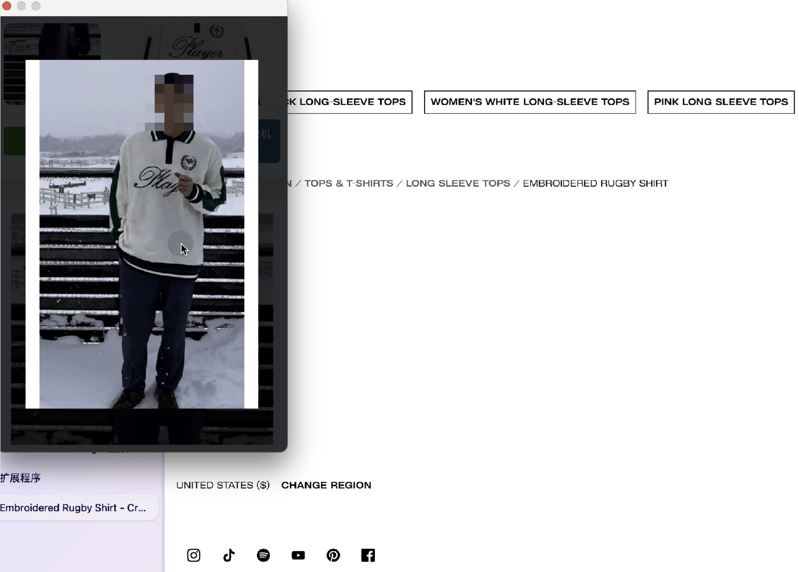

# 自助试衣间 Chrome 插件 / Self-Service Fitting Room Chrome Extension（StyleBuffet）

   

[English Version](#english) | [中文版本](#chinese)

## English Version

### Project Description

A virtual try-on Chrome extension. When shopping for clothes online, you can generate a try-on image based on your full-body photo and the product image from the e-commerce site. This extension utilizes the Keling large language model service. As the service access has a time window, it's named "Self-Service Fitting Room".

### Demo Video

Check out our [demo video](https://www.bilibili.com/video/BV1tkyYYbE16/?spm_id_from=333.999.0.0&vd_source=97fb05507112998874bd946470f720ff) to see how the extension works.

### How to Use

1. Click the "Get Fitting Room" button and enter the Token.
2. Once confirmed, the self-service fitting room becomes active.
3. While browsing web pages, right-click and copy the image of the clothing you want to try on.
4. Click on the paste area in the extension interface to paste the clothing image.
5. Click the "Try On" button.
6. Wait for about 10-15 seconds, and the try-on result will be displayed.
7. Click on the result image to enlarge it.

### Accessing the Self-Service Fitting Room

There are three ways to use the self-service fitting room:

1. Use the Keling large model on its [Hugging Face experience link](https://huggingface.co/spaces/Kwai-Kolors/Kolors-Virtual-Try-Onn).

2. Register for the Keling API service, obtain an access key and secret key, then generate an api_token.

3. Add my WeChat to get a free trial api_token (self-service fitting room).

### Installation Instructions

1. Download the ZIP file of this repository and extract it.
2. Open Chrome browser and go to the extensions page (chrome://extensions/).
3. Enable "Developer mode".
4. Click "Load unpacked" and select the extracted folder.

### Notes

- Ensure that your internet connection is stable.
- If you encounter any issues, please refresh the page or restart the extension.

### Privacy Statement

The uploaded pictures and the generated results are only transmitted to Keling LLM for processing and will not be uploaded to our server. But if you mind privacy, please choose whether to use it at your discretion.

### Development Plan

- [ ] Optimize UI
- [ ] Add iOS version support

### Acknowledgements

We would like to express our gratitude to the following projects that inspired and helped us:

- [AIDress](https://github.com/bingqiang2021/AIDress)
- [visual-try-on](https://github.com/shyjal/visual-try-on)

### Contact Us

If you have any questions or suggestions, please contact us through:

- Email: wangxiaost@gmail.com
- WeChat: See QR code above

### License

This project is licensed under the MIT License. See the [LICENSE](LICENSE) file for details.

[Back to Top](#)

---

## 中文版本

### 项目描述

一个试衣Chrome插件。当在电商选购衣服时，根据自己的全身照+电商图片 -> 试衣后的图片。使用到可灵大模型的服务，获取服务有时间窗口，故取名自助试衣间。

### 演示视频

查看我们的[演示视频](https://www.bilibili.com/video/BV1tkyYYbE16/?spm_id_from=333.999.0.0&vd_source=97fb05507112998874bd946470f720ff)，了解插件的使用方法。

### 使用流程

1. 点击"获取试衣"按钮，输入Token。
2. 确定后，自助试衣开始生效。
3. 浏览网页时,对于想试穿的衣服图片,右键点击复制。
4. 在插件界面中点击粘贴区域,将衣服图片粘贴上去。
5. 点击"试穿"按钮。
6. 等待10-15秒左右,试穿结果就会显示出来。
7. 点击结果图片可以放大查看。

### 获取自助试衣服务

有三种方法可以使用自助试衣服务:

1. 使用可灵大模型在Hugging Face上的[体验链接](https://huggingface.co/spaces/Kwai-Kolors/Kolors-Virtual-Try-Onn)。

2. 注册可灵API服务,获取access key和secret key,然后生成api_token。

3. 添加我的微信（请备注加上这个项目名）,获取免费的体验api_token进行体验。

   

均摊下来，每次调用可灵服务生成图片的成本为3毛钱。小贵，但是生成结果与原始图片的一致性很好。欢迎项目交流，实现在线试衣间自由！

### 安装说明

1. 下载本仓库的ZIP文件并解压。
2. 打开Chrome浏览器,进入扩展程序页面(chrome://extensions/)。
3. 启用"开发者模式"。
4. 点击"加载已解压的扩展程序",选择解压后的文件夹。

### 注意事项

- 请确保您的网络连接稳定。
- 如遇到任何问题,请刷新页面或重新启动插件。

### 隐私声明

- 上传的图片和生成的结果仅传给可灵LLM处理,不会上传到我们的服务器。但若介意隐私，请酌情选择是否使用。

### 开发计划

- [ ] 优化UI
- [ ] 加入iOS版本支持

### 致谢

我们要感谢以下项目，它们给予了我们灵感和帮助：

- [AIDress](https://github.com/bingqiang2021/AIDress)
- [visual-try-on](https://github.com/shyjal/visual-try-on)

### 联系我们

如有任何问题或建议,请通过以下方式联系:

- 电子邮件: wangxiaost@gmail.com
- 微信: 见上方二维码

### 许可证

本项目采用MIT许可证。详情请见[LICENSE](LICENSE)文件。

[返回顶部](#)
